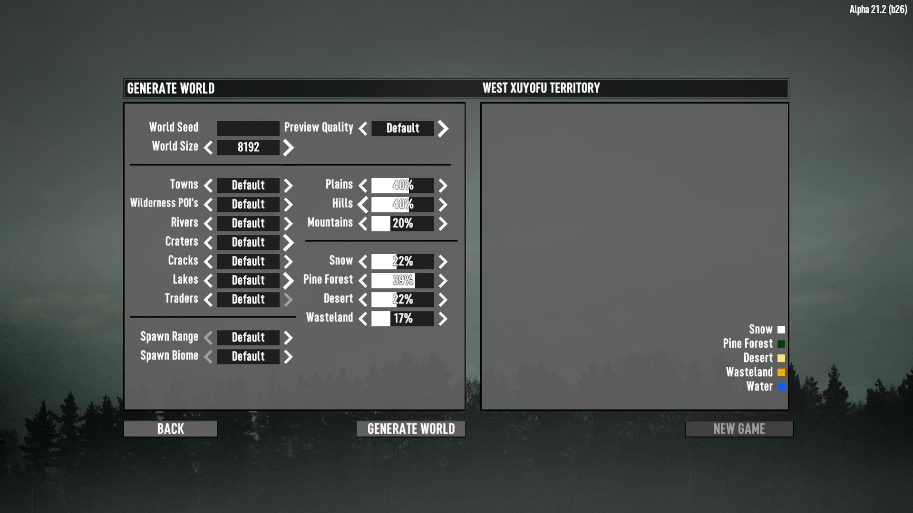

# RWGNoTraders

A mod for 7 Days to Die A21.

This mod patches RWG to be able to generate a world with no traders.

## Generator Options

This mod adds following options on RWG.

- Traders  
  Whether to spawn traders.

  - None  
    A random world be generated with no traders.
  - Default  
    A random world be generated on the logic of vanilla.

- Spawn Range  
  How many meters away from first trader (or city) should spawn points be placed?

  - Default  
    Spawn points are placed within 600 meters from a trader if a trader is spawned in the world, otherwise within 600 meters from a city or town.
  - Wide  
    Spawn points are placed within 1K meters from a trader if a trader is spawned in the world, otherwise within 1K meters from a city or town.

- Spawn Biome  
  Which biome should spawn points be placed in?

  - Default  
    Spawn points are placed in forest biomes whenever possible.
  - Randomize  
    Spawn points are randomly placed in any biome.

